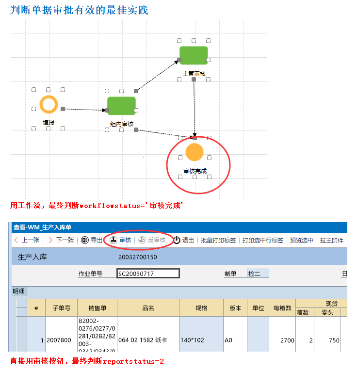
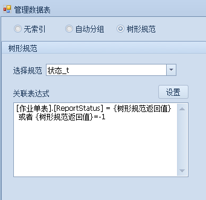
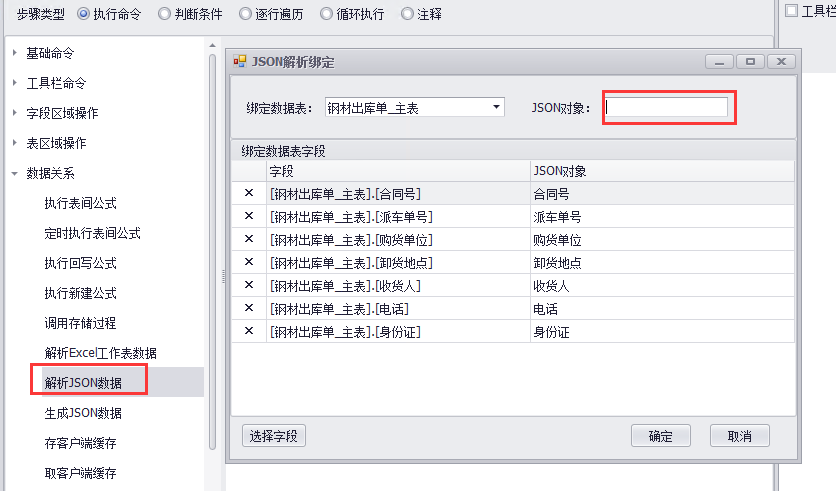

# 常见问题与技巧

## 转换ES库到NX库

SSMS种运行nxcells/server/upgrade/usql/下的：

`NxCreate.sql`，
`NxCreateFunc.sql`，
`NxCreateView.sql`，
`NxInit.sql`，

完成系统表注入和初始化，就可以直接新建NX账套，挂载ES库了，其他SAP/金蝶/用友同理。

## 映射已有ES表到NX工作台直接显示

主要是补充主表的recordid+createtime，明细的recordid+sequence

```sql
--补充主表
update 主表
	set recordid=stuff(stuff(excelserverrcid,1,4,'-'),9,2,'')
		,createtime=cast(substring(excelserverrcid,3,8) as datetime)
go
--补充明细
update 明细表
	set recordid=stuff(stuff(excelserverrcid,1,4,'-'),9,2,'')
		,sequence=excelserverrn
```

## ES图片附件迁移到JU/NX

```sql
--更新模板图片ID
update 新表
set 图片字段=b.pic,图片字段_I=b.pic
from (
select rcid,cast(stuff(substring(照片,4,100),7,1,'') as int)as pic 
from es库..ES_CasePic
where isnull(照片,'')<>''
) b ,新表,旧表
where b.rcid=旧表.excelserverrcid and 旧表.关联号=新表.关联号
select * from 新表
--复制图片到新库
insert JU_FileInfo
select cast(stuff(substring(picno,4,100),7,1,'') as int) ,j.RecordID,stuff(substring(picno,4,100),7,1,'')+p.fileType,img,'20200603'
from es库..ES_CasePic p
inner join 新表 j on cast(stuff(substring(p.picno,4,100),7,1,'') as int) =j.图片字段
--select * from JU_FileInfo
```

## NX中的插件包
自定义菜单等功能需要插件包，下载CEF包等后解压到`server/package`，重启服务即可。

下面是配置文件config.xml

```xml
<?xml version="1.0" encoding="utf-8" ?>
<packages>
	<package id="cef" plugin="1" hook="vcredist2013_x86.exe"/>
	<package id="hik" plugin="1"/>
	<package id="jieyu" plugin="1" hook="DoccameraOcx.exe"/>
	<package id="20180420"/>
</packages>
```

重装插件可以先删除client目录下的plugin.nxpm

> NX-杨工: 做package的原理是 ，打包发到客户端去。hook是把包里的可执行程序跑一下，cef 需要c++支撑环境

## NX中的日期有无判断
NX跟ES不同，不会因为被isnull转换过造成ES判断需要用`年(日期)=1900`这样的处理

简单直接的判断即可：

1. 对数据源(SQL)筛选时用：`目标日期字段 is null`，例如提数时明细有交期用明细交期否则用主表交期：`iif(订单明细.交期 is null, 订单主表.交期, 订单明细.交期)`

2. 对本表(SP)筛选时用：`本表日期字段 =''`，例如回写时本表明细有交期用明细交期否则用主表交期：`iif(本表订单明细.交期 = '', 本表订单主表.交期, 本表订单明细.交期)`

## 小数转文本去末尾0

> @伤疤也微笑: 用convert(float,总分)

```sql
--村长扩展:可以定义一个函数，后续直接用dbo.f_trim0(12.00)=12
create function f_trim0 (@dec decimal(32,2)) 
returns varchar(100)
as
begin
return CONVERT(varchar(100),CONVERT(float,isnull(@dec,0)))
end
```

## 字符分割函数split

> @崽团:DBO.MYSPLIT(字符串,取值位置,分隔符)，比如DBO.MYSPLIT("C10*10*20,2,"*")得到的结果就是10

```sql
CREATE FUNCTION [dbo].[mysplit] 
 (@str nvarchar(2000),--源字串
   @sn int,    --提取序号
   @Deli varchar(1) --分隔符
  )
   RETURNS varchar(100)
AS
BEGIN
declare @first int,@last int,@result varchar(1000),@sn0 int
select @sn0=0,@first=0,@LAST=1,@str=@str+REPLICATE(@DELI,1)
while @sn0!=@sn
 begin
 select @sn0=@sn0+1,@first=@LAST,@last=charindex(@DELI,@str,@LAST)+1
 end
if @last-@first-1<0
set @result=''
else
SET @RESULT=SUBSTRING(@str,@FIRST,@LAST-@FIRST-1)
RETURN ( @RESULT )
END
```

## 判断单据审批后有效的最佳实践



## 如何定期自动重存表单

> @常想一二：写个查询模板，作业定期自动填报，模板回写重存。


## sp模式模糊怎么破

字体设置：微软雅黑9号字

如果是高分屏，excel放大140%

## 关联打印纯查询模板预览不会出来

> @崽团：打印模板的表映射到原报表，关联时设置为查阅


## 控制输入时不能有空格

> @平淡人生：字段设置正则验证，`^[^\s]*$`

## 控制输入时必须有汉字(例如退回原因)

> @平淡人生：字段设置正则验证，`[\u4e00-\u9fa5]+`


## 别名引用注意事项

> @村长：如果你的模板以后会复制其他用途，还是自己定义别名吧，不要用ES/NX定义的别名，新模板会变

> Tips：ES的别名一般表是_EST开头，字段是_ESF开头，NX的别名一般表是_MT开头，字段是_MF开头

## 按系统状态分组

管理数据表本身不能直接按系统状态分组，没系统字段可选，而且像保存，审核状态后台实际是1，2这种数字。

> @村长：我们可以设置一个树形，返回-1，1，2显示全部，未审核，已审核，然后设置分组时关联这个树形即可。



## 重写系统按钮逻辑

> @村长：NX的按钮可以隐藏，例如保存，审核，打印预览等，我们可以自己设置一下按钮，勾选工具栏显示，加一些自己的逻辑，然后再调用这些隐藏的按钮即可实现重写按钮，实现一些例如记录打印次数，审核时间，保存前友情提示等功能。

## 影子模板

> @村长：NX的模板属性可以设置模板是否在客户端/移动端显示，我通常设计打印模板后会设置不显示，然后其他模板打印时关联打印这个模板，神不知鬼不觉。实现界面与打印分离。

## 协同填报

> @村长：模板属性勾选打开时为编辑状态，其他人就可以快速双击协同填报了，有时候可以代替工作流，像普通Excel一样方便

## 回写触发提数

> ES的回写是不能触发提数的，Nx只要勾选模拟填报即可实现。

## 工作流一键撤回修改

> @村长：工作流跑到一半或完结了也行，模板设置启动触发器，条件设置1=1，再加个按钮，删除ju_workflowtask中recordid等于本表单的记录，然后关联修改本记录即可，全部命令一键完成。

## 纯数组API提数

> @火星人：支持，典型的Table对象，api提数解决，表名不用刻意，i就可以了

## 重置管理员密码为空

```sql
update JU_User 
	set Password = 'e094fecbe7a6802adf7295c423c52631'
    ,[Salt]='8ab2'
where loginname='0824'
```

## 单选框字段设置为整数

> 技巧：可以在提数或报表命令里用`1-字段`来切换单选框状态，非常方便。

## 锁定界面

通常，sp界面可以鼠标滚动上下，要锁定界面，先按住ctrl键向下滚动鼠标让界面变小，再在右下区域点击一下，设置冻结，再按住ctrl键往上滚动鼠标，让界面恢复100%即可。


## 删除tmp_juxxxx临时表

因为设置失误等原因，提数回写可能会报错，并在数据库中残留tmp_juxxxx临时表，这些表用于debug，可以通过下面的脚本批量清理。

```sql
declare @deadline nvarchar(64)
set  @deadline = 't20200108' --这里的20200108改成自己需要的日期
declare @tableName nvarchar(64)  
declare tb_cur cursor for select name from SysObjects where xtype = 'U' and name like 'tmp_ju%'
open tb_cur
fetch next from tb_cur into @tableName 
  while (@@fetch_status=0) 
  begin
	  if CHARINDEX('t2',@tableName)>0 and SUBSTRING(@tableName,CHARINDEX('t2',@tableName),9)< @deadline
	  begin 
		 exec('drop table ' + @tableName)
	  end 
    fetch next from tb_cur into @tableName 
  end 
close tb_cur 
deallocate tb_cur
```

## 删除临时表对应的实体表

```sql
declare @sql nvarchar(512)
declare @tableName nvarchar(64)  
declare tb_cur cursor for select TableName from JU_TemplateTable where Created = 0 and TableType in(0,1,2)
open tb_cur
fetch next from tb_cur into @tableName 
  while (@@fetch_status=0)  
  begin
	set @sql = 'if object_id(N'''+@tablename+''',N''U'') is not null  drop table '+ @tablename +';'; 
	print @sql
    fetch next from tb_cur into @tableName 
  end 
close tb_cur 
deallocate tb_cur
```

## 调整旧库图片字段(2.9版以前升级上来的)

```sql
declare @sql nvarchar(512)
declare @tableName nvarchar(64)  
declare @fieldName nvarchar(64)  
declare tb_cur cursor for select f.FieldName,t.TableName from JU_TemplateTableField f join JU_TemplateTable t on f.TableID = t.TableID where (f.BaseDataType = 5 or f.BaseDataType = 6) and t.Created<>0 and f.Created<>0
open tb_cur
fetch next from tb_cur into @fieldName,@tableName 
  while (@@fetch_status=0)  
  begin
	set @sql = 'if col_length('''+@tablename+''','''+@fieldName+''') is not null  alter table ' + @tablename + ' alter column '+ @fieldName + ' nvarchar(128);'; 
	print @sql
    fetch next from tb_cur into @fieldName,@tableName 
  end 
close tb_cur 
deallocate tb_cur 
```

## 一键初始化(洗库)

```sql
declare @sql nvarchar(512)
declare @tableName nvarchar(64)  
declare @fieldName nvarchar(64)  
declare tb_cur cursor for select f.FieldName,t.TableName from JU_TemplateTableField f join JU_TemplateTable t on f.TableID = t.TableID where (f.BaseDataType = 5 or f.BaseDataType = 6) and t.Created<>0 and f.Created<>0
open tb_cur
fetch next from tb_cur into @fieldName,@tableName 
  while (@@fetch_status=0)  
  begin
	set @sql = 'if col_length('''+@tablename+''','''+@fieldName+''') is not null  alter table ' + @tablename + ' alter column '+ @fieldName + ' nvarchar(128);'; 
	print @sql
    fetch next from tb_cur into @fieldName,@tableName 
  end 
close tb_cur 
deallocate tb_cur 
```

## 模板异常：office检查到此文件存在一个问题。要帮助保护您的计算机，不能打开此文件。

>@废柴：如果是Office2013，要勾选COM加载项的Microsoft Office PowerPivot for 2013，如果是Office2010，可以考虑换成Office2007试试。

## 索引超出了范围，设计器出现红叉。

>@天涯：区域不连续时，容易出现这个错误提示，看下管理数据表定义区域是否整齐。

## 错误：对象不能从DBNull转换为其他类型。

>@火星人：执行下面的SQL，DBNULL 一般错误是系统字段没给默认值导致的

`update JU_TemplateTableField set AllowEditSysVar = 0`

`update JU_ActionStep set IsDisable = 0`

## 错误：提示XXXX正在办理

>@火星人：执行下面的SQL，检查办理权

`select TaskState,Locked,DealUser,* from ju_workflowTask  正常待办  TaskState = 0 Locked = 0 DealUser = null`

## 办理时出现错误：远程主机强迫关闭一个连接

办理的步骤：

* SELECT * FROM JU_WorkflowTask WHERE TaskID = ？  找到任务 ，检查任务状态，锁状态，办理人

* SELECT LockStatus FROM JUT110 WHERE RecordID IN (SELECT RecordID FROM JU_WorkflowTask WHERE TaskID = ? )   检查任务对应的报表的锁状态 

* UPDATE JU_AlertMessage SET MsgState = 0 WHERE MsgRefID = ？);
            //办理之后将消息设置成已阅状态

* UPDATE JU_Message set ReadTime=getdate(),MsgStatus =1 where MsgType = 1 and RefExpr = ？    将任务关联消息状态改变 。

* UPDATE JU_WorkflowTask SET Locked ={0} , DealUser ={1} WHERE TaskID ={2}   给任务加上处理锁 

检查相关表数据是否过大。

## NX图片压缩
客户端-模板属性-勾选允许存缩略图，图片将自动压缩为模板上画布大小

移动端-我-设置，可以设置上传图片的压缩比例


## NX直接解析对象
> @芳草无情：类似{key:value}，而不是{data:[]}的json,解析时json对象填 `+` 号即可



