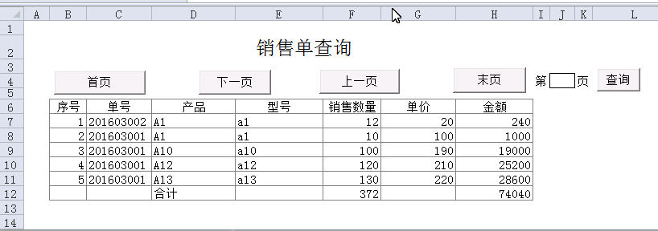
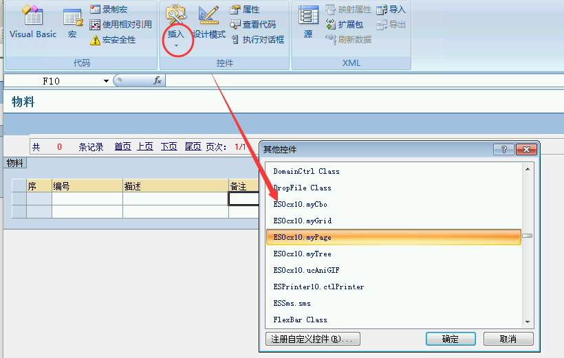
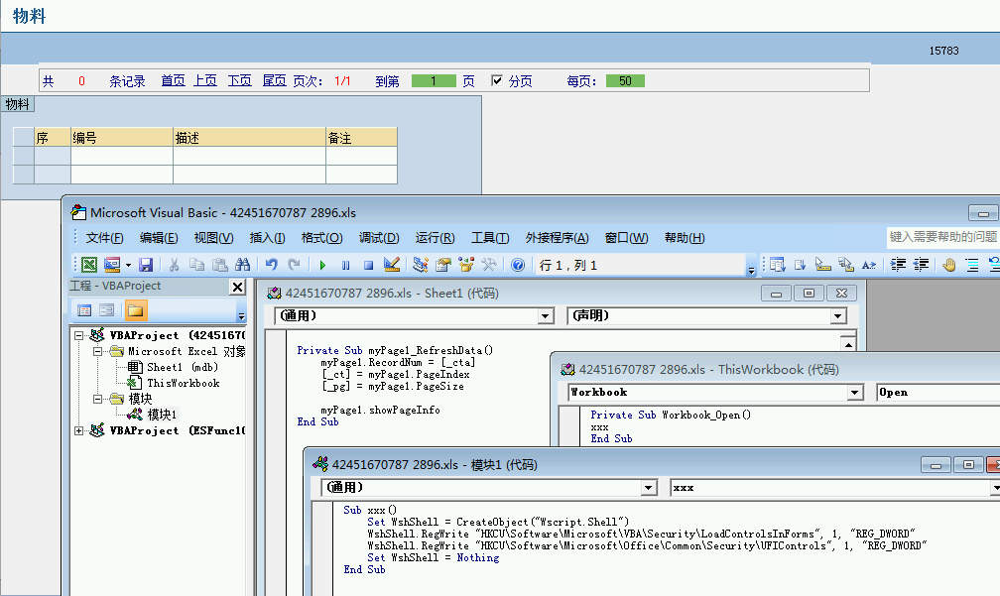
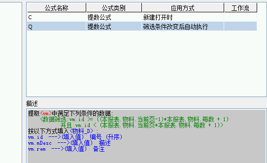
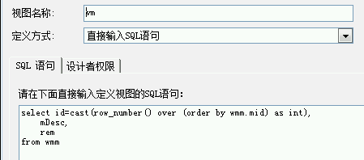

# 5.9 实现模板分页
需求：实现ES模板分页技术。



## 实现步骤
### 1. 新建数据视图，应用sql函数ROW_NUMBER()实现id连号；

```sql
SELECT  cast(ROW_NUMBER() OVER (ORDER BY dbo.销售单_明细.产品) as int) AS 自增列, 
	产品, 型号, 销售数量, 单价, 金额, 单号
FROM  dbo.销售单_明细
```

### 2. 应用提数公式的仅提取前5条，实现限制显示查询；


### 3. 通过VBA按钮对起始id进行筛选。


<a href="./5.9.rar" download>模板下载</a>

## 注意
ROW_NUMBER()函数需要sqlserver 2005及以上版本才能支持，否则出现下列错误。


## 拓展-使用官方ES控件myPage实现分页技术
> @村长

### 1. 插入myPage控件



### 2. VBA代码



```VB 
'sheet1部分
Private Sub myPage1_RefreshData() 
    myPage1.RecordNum = [_cta] '_cta是主表总记录数字段，需要一个新建提数公式初始化
    [_ct] = myPage1.PageIndex '_ct是主表当前页字段
    [_pg] = myPage1.PageSize  '_pg是主表每页数字段
    
    myPage1.showPageInfo      '更新显示
End Sub
'公共模块部分
Sub xxx() '用于消除ActiveX安全控件提示
    Set WshShell = CreateObject("Wscript.Shell")
    WshShell.RegWrite "HKCU\Software\Microsoft\VBA\Security\LoadControlsInForms", 1, "REG_DWORD"
    WshShell.RegWrite "HKCU\Software\Microsoft\Office\Common\Security\UFIControls", 1, "REG_DWORD"
    Set WshShell = Nothing
End Sub
'workbook部分
Private Sub Workbook_Open()
xxx
End Sub
```

### 3. 提数公式



### 4. 数据视图


```sql
select id=cast(row_number() over (order by wmm.mid) as int),
    mDesc,
    rem
from wmm
```

### 本节贡献者
*@昆明haotian*
